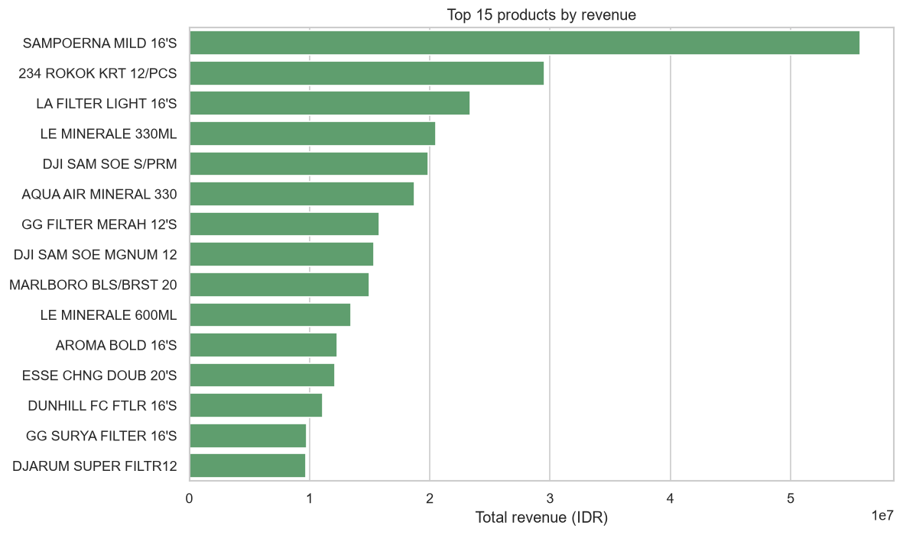
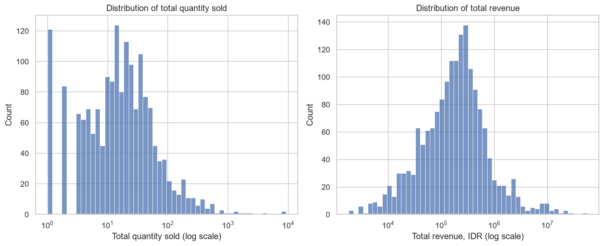
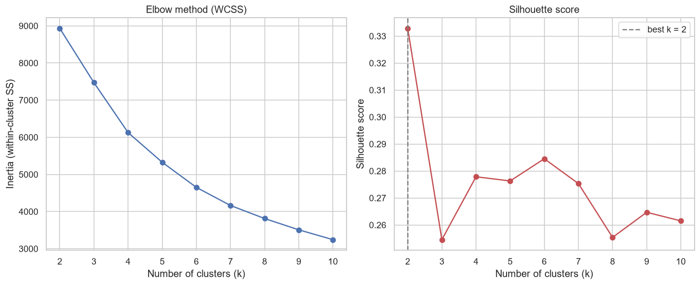
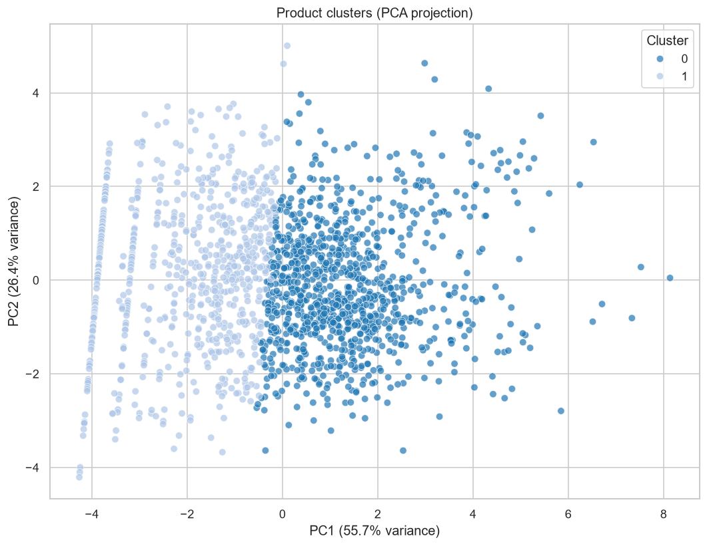
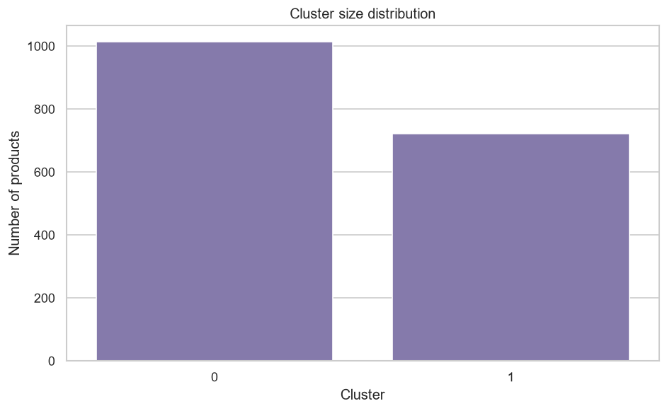

# Retail Product Segmentation with K-Means Clustering

**Turning 209 raw POS receipt logs into a data-driven product strategy for an
independent Indonesian supermarket.**

---

## The problem

**SWALAYAN KEADILAN**, a supermarket, had a year of sales data, but only as
raw point-of-sale printouts, one `.TXT` file per day. There was no product
catalogue with behavioural labels, no existing segmentation, and no way to
answer a simple business question:

> *Which of our ~1,700 products are worth deep stock and prime shelf space,
> and which are quietly eating space and capital?*

This project builds the full pipeline to answer that, from illegible receipt
text to a defensible, reproducible product segmentation.

## The approach

1. **Parse**: a custom parser reads the Indonesian POS receipt grammar
   (header dates, transaction timestamps, product/quantity line pairs,
   discount rows, excise markers, `.`-separated IDR amounts) straight into a
   structured transaction table.
2. **Clean**: dedupe, validate types, and drop malformed quantity/price rows.
3. **Explore**: quantify how skewed retail sales really are before choosing
   a scaling strategy.
4. **Engineer features**: aggregate 52k transaction lines into one
   behavioural profile per product (volume, revenue, price, transaction
   frequency, temporal patterns).
5. **Scale**: `log1p` then `StandardScaler`, so a handful of best-sellers
   don't swamp the geometry.
6. **Select k**: elbow method + silhouette score, not a guess.
7. **Cluster**: reproducible `KMeans(random_state=42)`, with excise goods
   (cigarettes) clustered separately since their price/revenue profile is
   structurally different.
8. **Translate**: turn cluster centroids into shelf, inventory, and
   promotion recommendations a store manager can act on.

Every stochastic step is seeded (`random_state = 42`); the entire pipeline is
one command (`uv run python -m src.run_pipeline`) and reruns to the same
numbers every time.

## Results at a glance

| Metric | Value |
| --- | --- |
| Raw receipt logs parsed | 209 daily `.TXT` files |
| Transaction lines extracted | 52,067 |
| Transactions | 24,070 |
| Distinct products segmented | 1,735 |
| Rows dropped during cleaning | 0 (clean source data) |
| Optimal k (silhouette-selected) | 2 general segments + excise refinement → **12 clusters total** |
| Best silhouette score | 0.333 at k = 2 |

### From raw sales behaviour to actionable segments

**Top products by revenue**: cigarettes and bottled water dominate the top
line.

**Quantity & revenue distributions**: strongly right-skewed, which drives the
`log1p` transform decision.

**Elbow + silhouette sweep**: silhouette peaks at **k = 2** (0.333), the
objective basis for choosing `k`.

**PCA projection**: the two segments separate cleanly along the first
principal component.

**Cluster sizes**: a revenue-dense core versus a large slow-moving long tail.

### The two-segment split, in numbers

| Segment | Products | Avg. qty sold | Avg. revenue (IDR) | Avg. price (IDR) | Revenue share |
| --- | --- | --- | --- | --- | --- |
| **Fast-moving core** | 1,014 | 89.0 | 938,088 | 12,863 | **93.0%** |
| **Slow-moving long tail** | 721 | 5.4 | 99,320 | 19,029 | 7.0% |

Fewer than 60% of products carry 93% of revenue. The excise-separated
refinement (the pipeline's default configuration) goes further, surfacing
distinct high-ticket and high-volume sub-segments inside that core, small
clusters of products averaging millions of IDR in revenue that a naive
two-way split would hide.

## Business impact

The segmentation converts directly into store-manager decisions:

- **Inventory:** deep safety stock and tighter reorder points for the
  fast-moving core; lean stock (or delisting review) for the long tail.
- **Shelf placement:** fast-movers at eye level and near entrances; premium
  high-ticket items in destination zones; long tail consolidated to free up
  space.
- **Promotions:** volume promotions to drive footfall on staples; margin-aware,
  targeted offers on premium items; bundle premium items with complementary
  fast-movers.
- **Capital efficiency:** a clear, data-backed shortlist for clearance or
  delisting review each cycle.

## Engineering practices demonstrated

- **Reproducibility-first**: a single seeded, idempotent pipeline
  (`src/run_pipeline.py`) takes raw receipts to final CSVs and figures with no
  manual steps.
- **Modular design**: parsing, cleaning, feature engineering, clustering, and
  visualization are independent, individually testable modules under `src/`.
- **Tested**: a `pytest` suite (`tests/`) covers the parser, preprocessing, and
  clustering logic against synthetic fixtures, no real customer data required
  to validate correctness.
- **Typed & linted**: `mypy` and `ruff` run in CI on every pull request;
  `loguru` structured logging replaces ad-hoc `print` debugging.
- **Modern tooling**: dependency and environment management via
  [`uv`](https://docs.astral.sh/uv/), locked with `uv.lock` for exact,
  reproducible installs.
- **Narrative deliverable**: a 15-section Jupyter notebook
  ([`notebooks/product_clustering.ipynb`](notebooks/product_clustering.ipynb))
  walks a non-technical stakeholder from raw data to business recommendation.

## Tech stack

`Python 3.11` · `pandas` · `numpy` · `scikit-learn` · `matplotlib` / `seaborn`
· `scipy` · `loguru` · `pytest` · `mypy` · `ruff` · `uv` · `Jupyter`

## Explore further

| Resource | Description |
| --- | --- |
| [`notebooks/product_clustering.ipynb`](notebooks/product_clustering.ipynb) | Full narrative walkthrough, all 15 phases, figures inline |
| [`reports/final_report.md`](reports/final_report.md) | Detailed technical report: method, results, limitations |
| [`README.md`](README.md) | Setup, reproduction steps, project layout |
| [`SPEC.md`](SPEC.md) | Receipt grammar and data schema specification |
| [`CLAUDE.md`](CLAUDE.md) | Full project brief and coding guidelines |

---

Dataset: 209 daily POS receipt logs from SWALAYAN KEADILAN, a real
Indonesian supermarket (2025). Raw receipts contain member PII and are not
published; the pipeline, code, and this report are.
