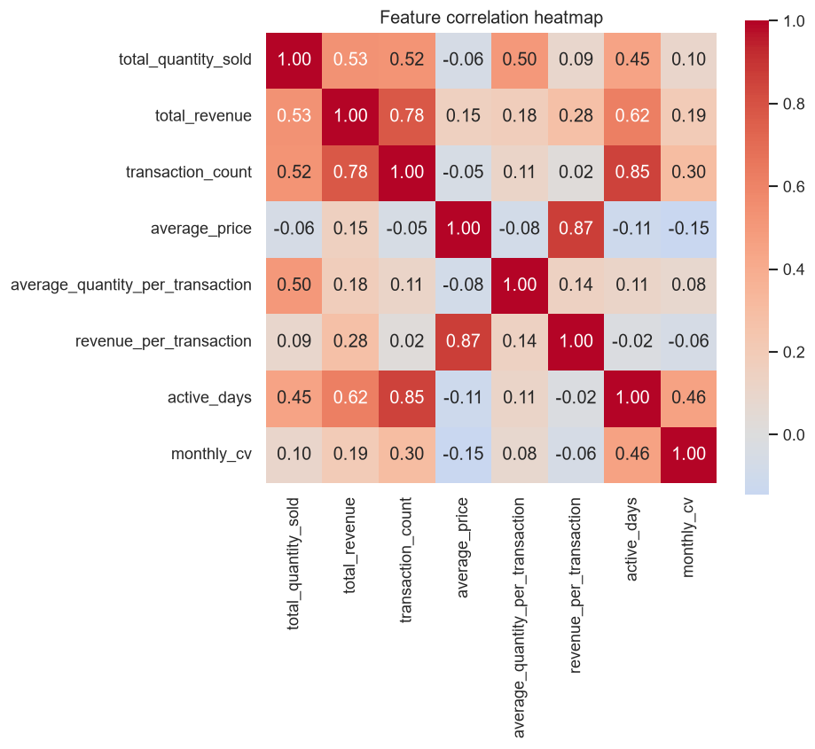
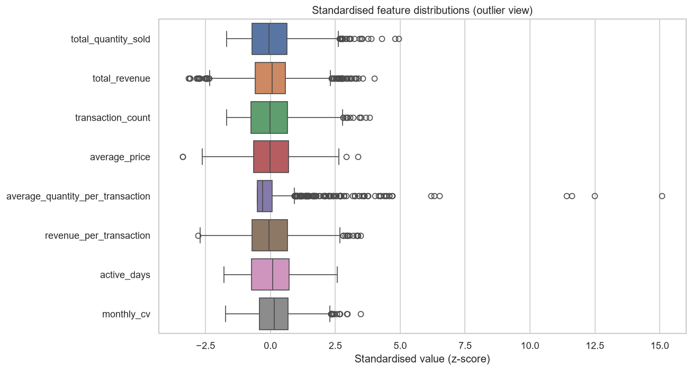

# Retail Product Clustering

K-Means product segmentation on real Indonesian supermarket POS receipt logs
("SWALAYAN KEADILAN", 2025). The pipeline parses raw receipts, engineers
product-level features, selects the number of clusters via the elbow and
silhouette methods, fits a reproducible K-Means model, and produces business
oriented cluster profiles and figures.

See [CLAUDE.md](CLAUDE.md) for the full project guide and [SPEC.md](SPEC.md) for
the data grammar and phase-by-phase specification.

## Gallery

A glance at the analysis, end to end — from raw sales behaviour to the final
product segments. Figures are regenerated by the pipeline into
`reports/figures/`; the copies below live in [`docs/images/`](docs/images/).

### Exploratory data analysis

<table>
  <tr>
    <td width="50%"></td>
    <td width="50%"></td>
  </tr>
  <tr>
    <td align="center"><sub><b>Top products by revenue</b> — cigarettes and bottled water dominate the top line.</sub></td>
    <td align="center"><sub><b>Quantity & revenue distributions</b> — strongly right-skewed, motivating the <code>log1p</code> transform.</sub></td>
  </tr>
  <tr>
    <td width="50%"></td>
    <td width="50%"></td>
  </tr>
  <tr>
    <td align="center"><sub><b>Feature correlation</b> — revenue tracks transaction count; price tracks revenue per transaction.</sub></td>
    <td align="center"><sub><b>Standardised features</b> — heavy outlier tails after scaling, the long-tail signature of retail.</sub></td>
  </tr>
</table>

### Choosing k and the resulting clusters

<table>
  <tr>
    <td width="50%"></td>
    <td width="50%"></td>
  </tr>
  <tr>
    <td align="center"><sub><b>Elbow + silhouette</b> — silhouette peaks at <b>k = 2</b> (0.333).</sub></td>
    <td align="center"><sub><b>PCA projection</b> — the two segments separate cleanly along PC1.</sub></td>
  </tr>
  <tr>
    <td colspan="2" width="100%"></td>
  </tr>
  <tr>
    <td colspan="2" align="center"><sub><b>Cluster sizes</b> — a revenue-dense core (cluster 0) versus a large slow-moving long tail (cluster 1).</sub></td>
  </tr>
</table>

## Requirements

- Python 3.11+
- [uv](https://docs.astral.sh/uv/) for environment and dependency management

## Setup

```bash
uv sync            # create .venv and install locked dependencies
```

The raw dataset under `dataset/` is gitignored (it is large and contains member
PII). Place the receipt logs in `dataset/struk penjualan 2025/` before running.

## Run the pipeline

```bash
uv run python -m src.run_pipeline
```

Outputs:

| Path | Contents |
| ---- | -------- |
| `data/processed/transactions.csv` | clean transaction table |
| `data/exports/product_features.csv` | product feature table |
| `data/exports/product_clusters.csv` | products with assigned clusters |
| `data/exports/cluster_profiles.csv` | per-cluster profile table |
| `reports/figures/*.png` | EDA and cluster visualisations |

## Notebook

[`notebooks/product_clustering.ipynb`](notebooks/product_clustering.ipynb) is the
narrative deliverable: it walks through all 15 phases (parsing, cleaning, EDA,
feature engineering, scaling, elbow, silhouette, K-Means, visualization,
profiling, and business insights) and renders every figure inline.

### Launch

```bash
uv run jupyter lab   # then open notebooks/product_clustering.ipynb
```

`uv run` executes inside the project's `.venv`, so the notebook shares the exact
locked dependencies as the pipeline. If you prefer the classic interface, use
`uv run jupyter notebook`. To register the environment as a named kernel (for
editors such as VS Code), run once:

```bash
uv run python -m ipykernel install --user --name retail-clustering
```

### What it needs

- The raw receipts must be present in `dataset/struk penjualan 2025/` — the
  first cell parses them directly (no separate pipeline run is required).
- The setup cell locates the project root automatically, so the notebook runs
  from any working directory.

### How to run it

Run the cells top to bottom (`Kernel -> Restart Kernel and Run All Cells`). The
sections are ordered as a dependency chain — each builds on the variables
defined above it:

1. parse and clean the receipts,
2. engineer product features and scale them (`log1p` + `StandardScaler`),
3. sweep `k` and pick the optimal value (elbow + silhouette),
4. fit the final K-Means model and assign clusters,
5. profile the clusters and add the excise-separated refinement (section 13b),
6. summarise the business insights.

Figures are written to `reports/figures/*.png` as they are produced and
displayed inline. Re-running the notebook is idempotent: it overwrites the same
output files each time.

### Run on Google Colab

The notebook runs on Colab without code changes. The dataset is **not** bundled
with the project (the repo is public and the receipts contain member names), so
you keep it on your own Google Drive and the notebook mounts it at run time.

First, put the `struk penjualan 2025` folder on your Google Drive in this exact
layout:

```
MyDrive/
└── ml-k-means-clustering/
    └── struk penjualan 2025/
        ├── 02-20250102.TXT
        ├── 02-20250103.TXT
        └── ... (209 .TXT files)
```

Then:

1. Upload the whole project folder to Colab (for example to `MyDrive`) and open
   `notebooks/product_clustering.ipynb` in Colab.
2. In the first code cell (**Google Colab setup**), edit the `DATASET_DIR` line
   so it points at the folder above:
   ```python
   os.environ["DATASET_DIR"] = "/content/drive/MyDrive/ml-k-means-clustering/struk penjualan 2025"
   ```
3. Run that first cell and approve the Google Drive mount popup.
4. `Runtime -> Run all`.

The setup cell installs the dependencies, mounts Drive, and sets `DATASET_DIR`;
the rest of the notebook is unchanged. To run the full pipeline from a Colab code
cell instead of the notebook flow, set the same variable inline:

```bash
!DATASET_DIR="/content/drive/MyDrive/ml-k-means-clustering/struk penjualan 2025" python -m src.run_pipeline
```

`DATASET_DIR` works anywhere — locally too, to point the pipeline at a dataset
outside the repo. When it is unset, the default `dataset/struk penjualan 2025/`
folder is used.

## Development

```bash
uv run python lint.py          # ruff check --fix, ruff format, mypy
uv run python lint.py --check  # no changes; fail if not clean (CI mode)
uv run pytest -q               # run the test suite
```

Run individual stages as modules, for example:

```bash
uv run python -m src.parser
uv run python -m src.clustering
```

## Project layout

```
src/            pipeline package (parser, preprocessing, feature_engineering,
                clustering, visualization, run_pipeline, config, schema)
tests/          pytest suite (synthetic data, no dataset needed)
notebooks/      product_clustering.ipynb
reports/        final report and generated figures (gitignored)
data/           processed and exported CSVs (gitignored)
dataset/        raw POS receipts and monthly reports (gitignored)
```

## Continuous integration

[`.github/workflows/ci.yml`](.github/workflows/ci.yml) runs lint, type-check,
and tests on every pull request into `main`. Work on a feature branch and open a
pull request; never commit directly to `main`.
